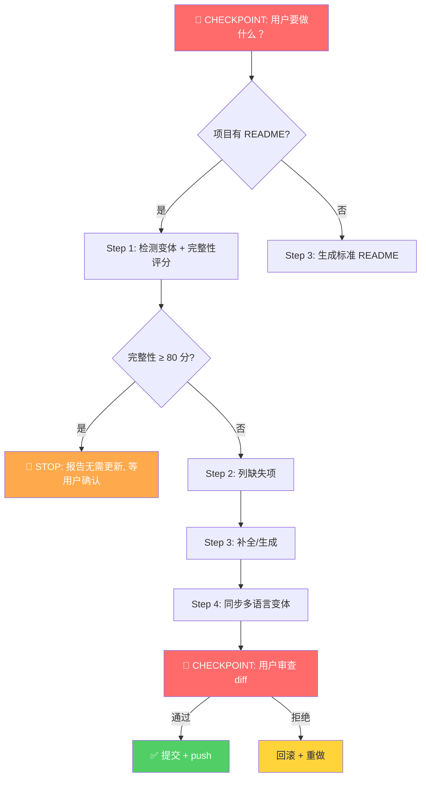

# readme-skill

> README 完整性检查与自动美化 — 检测并更新所有 README，与 SKILL.md 保持同步

## 触发条件

当需要以下操作时使用：
- 检查项目是否有 README
- 更新项目的 README
- 同步多个 README 变体
- 补全缺失的 README
- 美化现有 README（添加徽章、格式化）
- skill 创建/更新后检查 README

🔴 **CHECKPOINT**：确认用户需要执行哪个操作？
- 仅检测 → 执行 Step 1
- 美化现有 → 执行 Step 1-3
- 同步多语言 → 执行 Step 1-4
- 全新生成 → 执行 Step 3

## 核心流程



## 🔴 硬 STOP 门禁（执行前必读）

> **以下 5 个动作出现时，agent 必须 STOP 输出并等待用户确认，禁止自作主张：**

| 触发场景 | 错误做法 | 正确做法 |
|---------|---------|---------|
| 删除现有 README 章节 | 直接删 | 🔴 STOP：「检测到 [X] 章节，是否删除？」 |
| 修改 LICENSE 内容 | 改 | 🔴 STOP + 永远禁止（禁止行为表 #1）|
| 替换 emoji 标题为裸标题 | 改 | 🔴 STOP：「检测到破坏 emoji 规范，要继续吗？」|
| 同步时检测到多语言差异 > 30% | 强制覆盖 | 🔴 STOP + 报告差异 + 等用户决定主版本 |
| 写入文件失败 3 次 | 重试 | 🔴 STOP：「写入失败已 3 次，请检查权限/路径」|

```
┌────────────────────────────────────────────────────┐
│  🛑 STOP gate rule:                                │
│  发现上表 5 个场景之一 → 输出 🔴 STOP 消息         │
│  → 写"等用户确认" → 不调下一步 tool                │
│  → 禁止用"先做了再说"绕过                          │
└────────────────────────────────────────────────────┘
```

## BDD + TDD 开发流程（新增 Skill 或修改本 skill 时遵守）

### 判断标准

| 该用代码 | 该用 SOP/LLM |
|----------|-------------|
| 精确计算（版本 diff 百分比） | 决策判断（歧义、优先级） |
| 文件 IO（确定性读写） | 文本处理/格式化 |
| 幂等脚本（< 50 行） | 工作流编排 |

### 执行顺序

1. **先问**：能否用 SOP + LLM 解决？
2. 如果不行，再问：最小化代码方案是什么？
3. 最后才动手写代码
4. 代码总量控制：单一改动 < 150 行新增代码

### commit 时机规则

| 场景 | 时机 |
|------|------|
| Step 验证通过 | 每步完成后立即 commit |
| 发现新异常处理 | 立即记录到异常表，立即 commit |
| 盲区探索 | 先查 gql-skills，确认为盲区后再 commit |

## Step 1：检测 README 存在性和变体

```bash
# 检测所有 README 变体
find "$PROJECT_DIR" -maxdepth 2 -iname "readme*" -type f 2>/dev/null | sort
```

### 异常处理

| 触发条件 | 一线修复 | 仍失败兜底 |
|---------|---------|-----------|
| `find` 未找到任何 README | 创建空白 `README.md` 框架（见 Step 3） | 告知用户手动创建 |
| `check_readme_quality` 得分为空 | 返回 `score=0` + `issues="检测失败"` | 跳过评分，直接执行美化 |
| shields.io 徽章生成失败 | 改用文字链接 `[MIT]` | 移除徽章，保留占位注释 |
| 多语言变体内容差异过大 | 仅同步主版本变更 | 标记冲突，要求人工确认 |
| README 与 SKILL.md version 不匹配 | 自动更新 README 版本 | 提示用户检查 SKILL.md |

**如果检测失败 → 输出 `issues` 字段，不阻断后续流程。**

## Step 2：判断是否需要更新

### 必须更新的情况

| 徽章 | shields.io URL |
|------|---------------|
| License | `` |
| Version | `` |
| Platforms | `` |
| Category | `` |

### 必须包含的章节

|| 章节 | 说明 |
|------|------|
| `## 触发条件` | 什么情况下使用这个项目 |
| `## 功能特性` | 核心能力列表（`- 特性 1` 格式） |
| `## 安装` | 安装命令 |

### 开源 Skill 双语规则（TSENG 开源标准）

开源 skill 的 README 必须满足：

| 检查项 | 说明 |
|--------|------|
| `---` frontmatter（search: false）| 防止搜索引擎索引 |
| frontmatter 后第一行 `# 标题` | 不是空行不是 `---` |
| **emoji 图标** | 标题前必须有 emoji（如 🌱🛠️📦），配合 `div align="center"` 居中 |
| 中英互相引用（顶部第一行） | `**[English](README.md) · [中文](README_zh.md)**` |
| platforms badge | shields.io badge（License / Python 版本 / 平台） |
| 依赖表 | `pip install xxx` 格式 |
| 欢迎贡献文案 | 明确邀请 PR/Issue |
| 外部 skill 说明 | 引用外部 skill 时，必须说明"为什么相关"，不能只给链接 |
| 参考资料引用 | 若参考了其他文档/博客，需在底部 `## References` 列出 |

**禁止在 README 中写 "Known Pitfalls" / "已知坑"**——开发踩坑放 `references/` 或 CONTRIBUTING.md。

### 推荐包含的章节

| 章节 | 说明 |
|------|------|
| `## 快速开始` | 最少步骤跑起来 |
| `## 文件结构` | 目录/文件说明 |
| `## 安装后验证` | 检查清单（`- [ ]` 格式） |
| `## 相关 Skills` | 关联项目 |
| `## 许可证` | MIT 等 |

## Before / After 示例

### Before（不完整）

```markdown
# my-skill

这个 skill 用来做某件事

## 使用

运行 xxx 即可
```

### After（完整，含 emoji + 居中）

```markdown
---
search: false
---

<div align="center">

# 🛠️ my-skill

**[English](README.md) · [中文](README_zh.md)**

[]
[]
[]
[]

*做某件事的 skill*

</div>

## 🎯 触发条件

当需要做某件事时使用。

## ✨ 功能特性

- 特性 1
- 特性 2

## 🚀 快速开始

```bash
hermes skills install https://github.com/relunctance/my-skill
```

## 📦 安装

```bash
hermes skills install https://github.com/relunctance/my-skill
```

## 📁 文件结构

```
my-skill/
├── SKILL.md
├── README.md
└── scripts/
```

## ✅ 安装后验证

- [ ] skill 加载成功
- [ ] 触发词生效

## 🔗 相关 Skills

- [skill-created](https://github.com/relunctance/skill-created) — 创建新 skill

## 📜 许可证

MIT
```

> **emoji 图标规范（强制）：**
> - `h1`（`#`）→ 🛠️ 等项目相关 emoji，**必须**
> - `h2`（`##`）→ 🎯 / ✨ / 🚀 / 📦 / 📁 / ✅ / 🔗 / 📜 等，**必须**
> - `h3`（`###`）→ 🔧 / 📌 / ⚠️ 等，按需使用
> - 每个 `##` 章节都必须有图标，不能裸标题

> **注意**：`---` frontmatter 放在 `# 标题` **之前**是正确的标准做法。README 顶行是 `---`，第二行是 `<div align="center">`，第三行是 `# 🛠️ 标题`，第五行是 `**[English](README.md) · [中文](README_zh.md)**`（中英互相引用）。

## 与 SKILL.md 同步规则

| SKILL.md 字段 | → README 内容 |
|--------------|--------------|
| `name` | 标题 |
| `description` | 首段描述 |
| `version` | shields version 徽章 |
| `license` | shields license 徽章 |
| `category` | shields category 徽章 |
| `metadata.hermes.platforms` | shields platforms 徽章 |
| `triggers` / description | 触发条件章节 |

## ⚠️ 危险信号表

🔴 **以下症状出现时，立即停止并诊断**：

| 危险信号 | 症状 | 根因 | 正确做法 |
|----------|------|------|----------|
| 空白画布 | 生成的 README 无内容 | Step 1 `find` 未找到文件 | 确认 `$PROJECT_DIR` 路径正确 |
| 徽章 404 | shields.io URL 返回 404 | shields.io 临时故障或 URL 错误 | 改用文字链接 `[MIT]`，保留占位注释 |
| 双语不同步 | README.md ≠ README_zh.md 内容差异大 | 多语言变更未同步 | 仅同步主版本，标记冲突要求人工确认 |
| frontmatter 污染 | README 出现 YAML frontmatter | 用户误将 SKILL.md frontmatter 复制到 README | README 顶行必须是 `---` 或 `<div>`，frontmatter 只在 SKILL.md 中 |
| 章节裸标题 | `## 安装` 无 emoji | 未应用 emoji 规范 | 每个 `##` 必须有 emoji 图标 |
| 版本不一致 | README version ≠ SKILL.md version | 多语言变更未同步 | 自动更新 README 版本，或提示检查 SKILL.md |

## 禁止行为清单

| 禁止 | 后果 | 正确做法 |
|------|------|----------|
| 修改 LICENSE 文件 | 法律风险 | 只更新文档，不动许可证 |
| 覆盖已有有效内容 | 用户数据丢失 | 只补充缺失项，不删除已有内容 |
| 使用非 shields.io 徽章 | 风格不一致 | 统一 shields.io 格式 |
| README 顶行是 `# 标题`（无 frontmatter） | frontmatter 规范缺失 | 顶行必须是 `---`（search: false）|
| README 无 emoji 图标 | 视觉混乱 | 每个 `##` 章节必须有 emoji |

## ⚠️ 引用外部 Skill 的强制校验规则

🔴 **每次引用外部 Skill 仓库地址时，必须先查 gql-skills 确认真实地址。**

典型错误：凭记忆写 `relunctance/xxx`，实际仓库名可能是 `safishamsi/xxx`。

校验流程：
1. 查 `gh issue list --limit 50 --search "{skill名}"` 在 gql-skills 仓库
2. 找到对应 issue 后读 body，确认 `仓库：`字段的真实地址
3. 用真实地址替换，不要猜测

禁止：
- ❌ 凭记忆写 GitHub 用户名
- ❌ 猜测仓库名（如把 `bdd-skill` 写成 `bdd-skill-design`）
- ❌ 写 `github.com/relunctance/xxx` 前不验证

违反此规则的教训：graphify 被写成 relunctance/graphify（应为 safishamsi/graphify），bdd-skill 被写成 bdd-skill-design（应为 bdd-skill）。

## references/ 索引

详见 [references/README.md](references/README.md)（5个文件：徽章规范/双语同步/emoji规范/frontmatter规范/同步规则）

## 安装

```bash
# Hermes
hermes skills install https://github.com/relunctance/readme-skill
```
